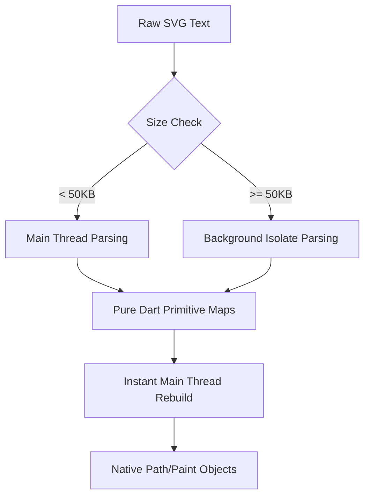

<p align="center">
  
</p>

<h1 align="center">Flutter SVG Pro</h1>

<p align="center">
  <b>A high-performance, interactive, and isolate-powered SVG rendering and parsing engine for Flutter. Tap regions, resolve rich CSS sheets, and build premium interactive vector experiences.</b>
</p>

<p align="center">
  <a href="https://pub.dev/packages/flutter_svg_pro">
    
  </a>
  <a href="https://github.com/khsuzan/flutter_svg_pro">
    
  </a>
  <a href="https://flutter.dev">
    
  </a>
</p>

---

## What is Flutter SVG Pro?

**Flutter SVG Pro** is a modern, state-of-the-art interactive SVG widget that allows you to turn vector graphics into living, responsive user interfaces. 

Whether you are building interactive car part diagrams (e.g. for damage reporting), anatomical charts, interactive maps, or custom vector dashboards, Flutter SVG Pro parses your SVGs, extracts individual components, resolves complex styling rules, and lets users tap and select parts with perfect precision.

---

## Why Flutter SVG Pro? 

Standard packages (like `flutter_svg`) are designed purely for **static image rendering**. If you need to make individual parts of your SVG interactive (e.g. tapping a specific car fender, a province on a map, or a muscle group on a body diagram), static renderers fall short:
1. They render the SVG as a single flattened canvas, making it impossible to listen to individual path events.
2. They do not maintain dynamic, isolated state layers for individual vector sub-elements.
3. They cannot dynamically resolve interactive CSS state overlays (such as select highlights).

**Flutter SVG Pro is built specifically to solve this.** It parses and retains the full semantic structure of your SVGs, giving you absolute control over selection states, styling, and hit-testing on a per-element basis.

---

## Key Features

* 🖱️ **Interactive Hit Testing**: Tap-to-select specific regions, paths, or groupings with coordinate mapping. Includes custom highlight overlay effects.
* 🎨 **CSS & Embedded Styling Support**: Full resolution of inline styles and external/embedded `.css` stylesheets (supporting selectors, classes, custom fill/stroke properties, opacity, and cascading priorities) through the `SvgStyleRegistry`.
* ⚡ **Hybrid Isolate-Powered Parsing**: Blazing-fast initial loads. Automatically parses small SVGs (<50KB) synchronously on the main thread in under `2ms` to eliminate isolate spawn delay. Automatically offloads larger SVGs to a background isolate via `compute` using a lightweight, zero-copy pure Dart primitive transfer protocol to prevent UI stutters.
* 📦 **Flexible Selection Modes**: Supports single-selection and multiple-selection modes out of the box with intuitive callbacks.
* 📐 **Aspect-Ratio & Transformation Aware**: Perfectly fits vector contents inside any layout constraints by automatically calculating `viewBox` coordinates and falling back to dimensions if needed.
* 🏷️ **XML Wrapper & Tooltip Support**: Gracefully extracts anchor elements (`<a>`), custom identifiers (`id`), and tooltips (e.g., `showTooltip(...)`) to auto-generate beautiful tooltip labels.

---

## Installation

Add this to your Dart package's `pubspec.yaml` file:

```yaml
dependencies:
  flutter_svg_pro: ^1.0.0
```

Then, run `flutter pub get` in your terminal.

---

## Usage Guide

Here is a complete, copy-pasteable example of how to implement `SvgProViewer` inside a Flutter application:

```dart
import 'package:flutter/material.dart';
import 'package:flutter_svg_pro/flutter_svg_pro.dart';
import 'package:flutter/services.dart' show rootBundle;

void main() {
  runApp(const MyApp());
}

class MyApp extends StatelessWidget {
  const MyApp({super.key});

  @override
  Widget build(BuildContext context) {
    return MaterialApp(
      title: 'Flutter SVG Pro Demo',
      theme: ThemeData(colorSchemeSeed: Colors.blue, useMaterial3: true),
      home: const SvgDemoPage(),
    );
  }
}

class SvgDemoPage extends StatefulWidget {
  const SvgDemoPage({super.key});

  @override
  State<SvgDemoPage> createState() => _SvgDemoPageState();
}

class _SvgDemoPageState extends State<SvgDemoPage> {
  SvgSelectionMode _mode = SvgSelectionMode.single;
  String _selectionInfo = 'Tap on parts to select them';
  
  // Future to load SVG and CSS raw string data
  late Future<Map<String, String>> _loadFuture;

  Future<Map<String, String>> _loadAssets() async {
    final svgData = await rootBundle.loadString('assets/car-front.svg');
    final cssData = await rootBundle.loadString('assets/cardiagram.css');
    return {'svg': svgData, 'css': cssData};
  }

  @override
  void initState() {
    super.initState();
    _loadFuture = _loadAssets();
  }

  @override
  Widget build(BuildContext context) {
    return Scaffold(
      appBar: AppBar(title: const Text('Flutter SVG Pro Demo')),
      body: Padding(
        padding: const EdgeInsets.all(16.0),
        child: Column(
          children: [
            // Mode selector
            Row(
              children: [
                const Text('Selection Mode: '),
                const SizedBox(width: 8),
                SegmentedButton<SvgSelectionMode>(
                  segments: const [
                    ButtonSegment(value: SvgSelectionMode.single, label: Text('Single')),
                    ButtonSegment(value: SvgSelectionMode.multiple, label: Text('Multiple')),
                  ],
                  selected: {_mode},
                  onSelectionChanged: (set) {
                    setState(() {
                      _mode = set.first;
                      _selectionInfo = 'Tap on parts to select them';
                    });
                  },
                ),
              ],
            ),
            const SizedBox(height: 16),
            
            // Svg Viewer Container
            Expanded(
              child: FutureBuilder<Map<String, String>>(
                future: _loadFuture,
                builder: (context, snapshot) {
                  if (snapshot.connectionState == ConnectionState.waiting) {
                    return const Center(child: CircularProgressIndicator());
                  }
                  if (snapshot.hasError) {
                    return Center(child: Text('Error loading SVG: ${snapshot.error}'));
                  }

                  final data = snapshot.data!;
                  return SvgProViewer(
                    rawSvg: data['svg']!,
                    externalCss: data['css'],
                    selectionMode: _mode,
                    selectionHighlightColor: const Color(0x804CAF50), // Semi-transparent highlight
                    onPartSelected: (part) {
                      debugPrint('Tapped part: ${part.name} (ID: ${part.id})');
                    },
                    onSelectionChanged: (selectedParts) {
                      setState(() {
                        _selectionInfo = selectedParts.isNotEmpty
                            ? 'Selected: ${selectedParts.map((p) => p.name).join(', ')}'
                            : 'Tap on parts to select them';
                      });
                    },
                  );
                },
              ),
            ),
            
            // Selection Info Footer
            const SizedBox(height: 16),
            Card(
              elevation: 0,
              color: Theme.of(context).colorScheme.surfaceVariant,
              child: Padding(
                padding: const EdgeInsets.all(12.0),
                child: Text(
                  _selectionInfo,
                  textAlign: TextAlign.center,
                  style: Theme.of(context).textTheme.bodyMedium,
                ),
              ),
            ),
          ],
        ),
      ),
    );
  }
}
```

---

## Advanced Architecture & Performance

To offer a smooth vector rendering performance with zero UI lag on mobile devices, **Flutter SVG Pro** utilizes a hybrid dual-isolate execution workflow:



### 1. The 50KB Auto-Threshold
Spawning a background isolate using Flutter's `compute` method has a startup cost of approximately **100ms** (initializing a brand-new Dart VM thread). 
* **Small SVGs (<50KB)**: Bypasses Isolate setup completely. It runs directly on the main thread inside **less than 2ms**, loading your vector instantly.
* **Large SVGs (>=50KB)**: Automatically offloads recursive XML traversal, transform multiplications, and geometry operations to a background isolate, keeping your UI thread running at a smooth **120 FPS**.

### 2. Zero-Copy Isolate Transfers
Transferring native-backed graphics bindings (like `dart:ui`'s `Path` and `Paint`) or complex nested object graphs (like `XmlDocument`) across isolates causes massive serialization overhead and heap spikes. 
The background isolate in **Flutter SVG Pro** only communicates using standard, raw Dart primitive structures (`List`, `Map`, `String`, `double`). It parses raw graphics into unified path string commands (`M x y ...`) and transfers them back instantaneously with minimal memory footprints, perfectly avoiding low-memory crashes on resource-constrained devices.

---

## License

This project is licensed under the MIT License - see the [LICENSE](LICENSE) file for details.
